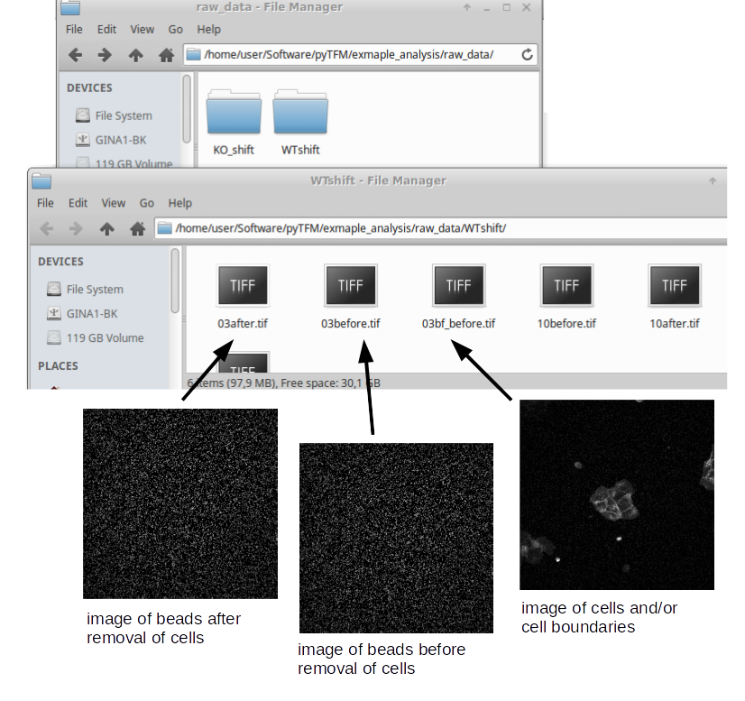
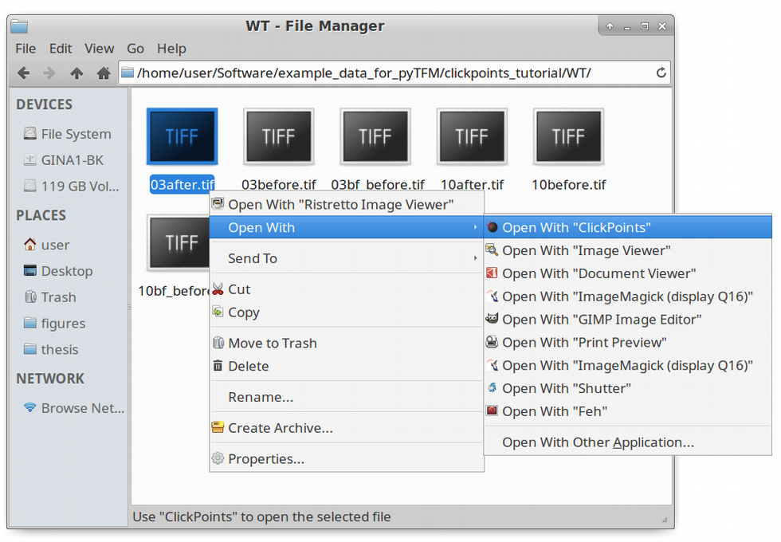
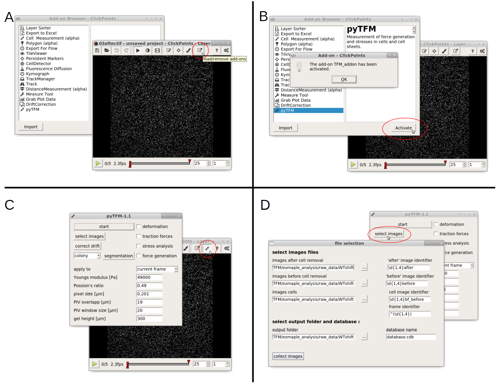
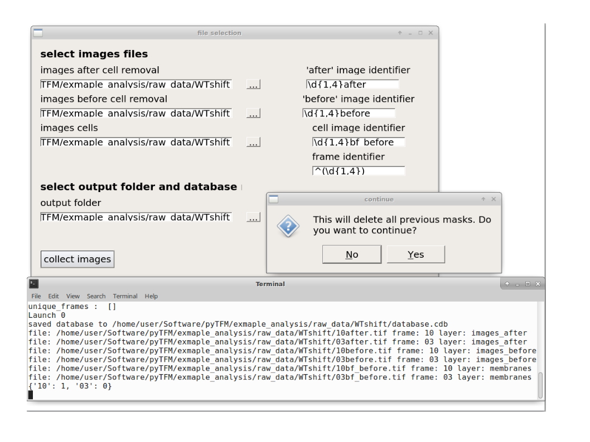
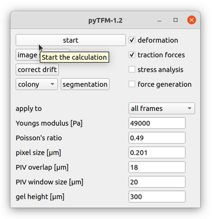
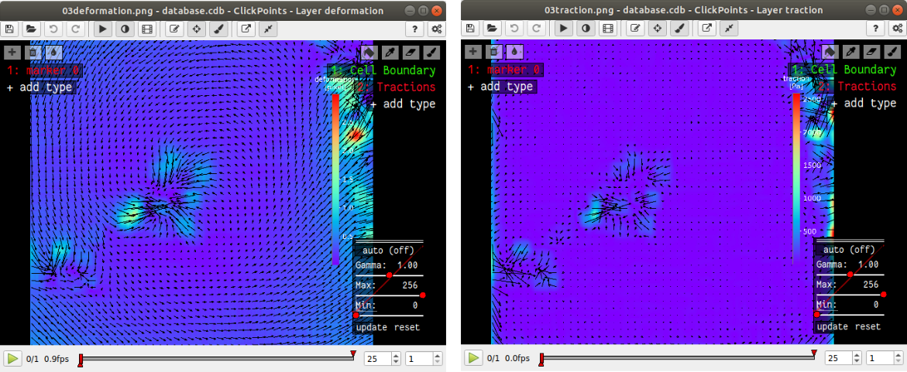
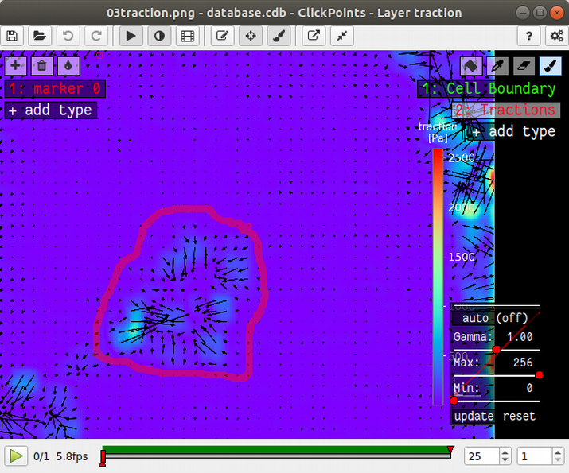
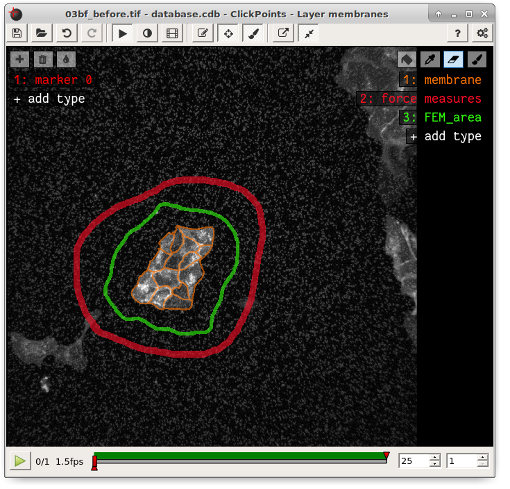
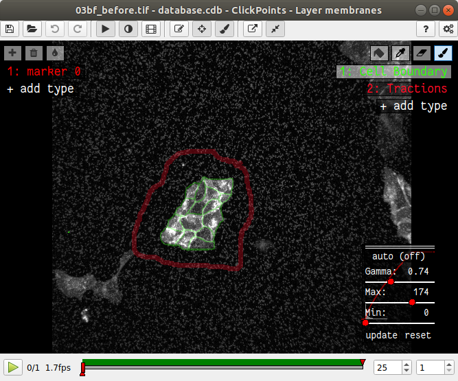
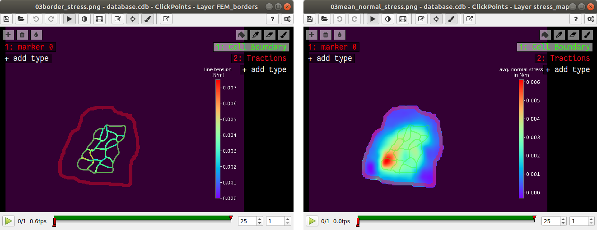

Analyzing Force Generation and Stresses in Cell-Colonies with Clickpoints
=================================================================================================

About this Tutorial
-------------------
Using the pyTFM clickpoints addon requires a complete installation of clickpoints.
If you have set up clickpoints correctly, you can open images by right clicking on the image files and select
"open with clickpoints".

First `download the example data set <https://github.com/fabrylab/example_data_for_pyTFM/archive/master.zip>`_ and unzip
the files. This data set contains raw data for 2 types of cell colonies: In one group a critical cytoskeletal protein
has been knocked out.
We will compare these cell colonies to a set of wildtype colonies. The raw data, in the form of images,
is contained in the subfolders "WT" and "KO". All output files, databases and plots as you should produce them
in the course of this tutorial are stored in the folders "KO_analyzed", "WT_analyzed" and "plots". Use these folders
to check if your analysis was correct.

The Data
-----------

As you can see in :numref:`data`, there are 6 images for each colony type. This corresponds to two field of views
for each wildtype and KO. For each field of view there are 3 images. One image (e.g. 03bf_before.tif) shows the colony
and the boundaries between cells. In this case the image shows fluorescence stained cell membranes.
The other two images show beads that are embedded in the substrate that the cells lie on. One image was recorded before
the cells were removed (03before.tif) and the other was recorded after the cells were removed (03after.tif).
The number in front of the filename ("03", "10" and so on) indicates which field of view that image belongs to.

    
    Data structure of a Traction Force Microscopy experiment.

Opening Clickpoints and sorting Images
------------------------------------------

The first step to analyze the data is to create a clickpoints database, in which the images are identified correctly,
concerning their type (whether it's an image of the cells or an image of the beads before or after cell removal)
and concerning the field of view they belong to.
We are going to start with the wildtype data set. To open a database simple right click on an image and
select "open with"-->"clickpoints". The option to open with clickpoints might also be visible directly after you right clicked.

    
    Opening images with clickpoints.
    
     

Clickpoints sorts images in two dimensions: Frames and layers. The frames are displayed in the bar at the bottom.
You can skip from frame to frame using the left and right arrows on your keyboard. Layers can be changed
with the "Page Up" and "Page Down" keys. When you open the database, you will notice that there is only one layer
and every image is sorted into a new frame. Our goal is to sort each field of view into one frame, with three layers per
frame, each representing one type of image. In order to do this you need to open the pyTFM addon and open the
"select image" menu. Follow the steps described in :numref:`open_select_images`.

    A: Open the addon-browser in clickpoints. A new window, with all available addons will open.
    B: Activate the pyTFM addon by selecting pyTFM and clicking the "Activate" button. A window notifying you
    that the addon has been loaded successfully will appear. After you press "OK" a new icon
    will appear in the clickpoints main window to the right of the addon-browser button. C: Click on this button
    to open the pyTFM addon. D: Finally, open the menu to select images by pressing the "select images" button.

The "file selection" manu allows you to do three things: You can select where images are
located and how they are classified. You can also set an output folder, where the database file and all analysis
results will be saved and you can choose a name for the database.
As mentioned above, the analysis requires three types of images. For each type you can select a folder
(left hand side) and a regular expression that identifies the image type from the image filename (right hand site).

.. note::
    Regular expressions are the standard way to find patterns in texts. For example, it allows you to
    identify numbers of certain length, groups of characters or the beginning and end of a text. You
    find more information on regular expressions `here <https://docs.python.org/3/library/re.html>`_.
    Some useful expressions are listed in the table below:

   ==============    ==============================================================
   search pattern     meaning
   ==============    ==============================================================
   after              all files with "after" in the filename
   ^after             all files with "after" at the beginning of the filename
   after$             all files with "after" at the end of the filename
   \*                 all files
   ^(\d{1-4}) 	      up to 4 numbers at beginning of the filename
   (\d{1-4}) 	      up to 4 consecutive numbers anywhere in the filename
   (\d{1-4})$ 	      up to 4 numbers at end of the filename
   ==============    ==============================================================

The "'after' image identifier" identifies images of beads after cell removal, the "'before' image identifier"
identifies images of beads before cell removal and the "cell image identifier" identifies images that
show the cells or cell membranes. Finally, there is a separate regular expression, the
"frame identifier" that identifies the field of view each image belongs to. This must point to a
number (e.g. "02" or "2" and so on) in the image filename. This number must be specially marked by brackets "()".
Note that the extension (".png",".tiff", ".jpeg" ...) must not be included in the identifiers.

The default identifiers fit to the example data set, meaning that for now and in the future if you are using the same
naming scheme for your images, you can leave the identifiers as they are. Once you have entered identifiers for
image types, frames, the output folder and the database name press the "collect image" button.
You should see something like this:

    
    Output of collect images.

Make sure your database didn't contain any masks that you don't want to delete. If you just opened the
database from new images, you can press OK. The path to the images that are sorted into the database,
the type of the images (layer) and the field of view of the images (frame) are printed to the console.
Make sure all images are sorted correctly. The program has now generated a clickpoints database and sorts
images into layers and frames. Your clickpoints window updates automatically.

.. TODO: mention correct Drift

.. TODO: paramters seting and recomondation

Setting Parameters
--------------------------------------------
Lets continue with calculating the deformation and traction field. Go to the pyTFM addon window
(:numref:`main`).

    
    Main addon window.

In this window you have to set the mechanical parameters of the substrate ("Youngs modulus" and "Poisson's
ratio"), the height of the substrate ("gel height") and the pixel size ("pixel size"). Then you have to set two more
parameters for the calculation of the deformation field. The deformation field is calculated with particle image
velocimetry. This method essentially cuts out square shaped patches from the image of
the beads before cell removal, places them on the image of beads after cell removal
and checks how well they fit together. The vector form the original position of the patch and the
position where the patch fits best to the image of beads after cell removal is the displacement vector.
This is done for many positions to generate a complete displacement field.

You can control two things: the size of the patch that is cut out of the image of the beads
after cell removal (with the parameter "PIV window size") and the resolution of the
resulting displacement field (with the parameter "PIV overlapp"). A window size that is to large will blur
the displacement field while a window size that is to small will introduce noise in the displacement field.
As a rule of thumb the window size should be roughly 7 times the bead diameter, you should however try a few
values and check which window size yields a smooth yet accurate deformation field.

.. Note::
    You can measure the beads diameter directly in clickpoints using another addon: The Measure Tool

The "PIV overlapp" mainly controls the resolution of the resulting displacement field and must be
smaller then the "PIV window size" but at least half of the "PIV window size". You need
a high resolution for analyzing stress. In this step the area of cells should at least contain 1000
pixels. However, if you are not calculating stresses, you can save a lot of calculation time by choosing a
"PIV overlapp" closer to half of the "PIV window size". Especially, when you are trying out different window sizes,
you can set the overlap to the smallest allowed value, which is half of the window size.

For this tutorial you can keep all parameters at their default value.

Calculating Traction and Deformation Fields
--------------------------------------------
Once you have set all parameters you can start the calculation: Use the tick boxes in the upper right to select
which part of the analysis you want to perform. For now, we are gonna select only "deformation" and "traction". Then
use the "apply to" option to choose whether all frames should be analyzed or only the frame that you are currently
viewing. Your window should now look like :numref:`main`. Finally press "start" in the upper left to begin the analysis.
With the default parameters this takes about 5 minutes per frame. "calculation complete" is printed to the console
once all frames have been analyzed.

The traction and deformation fields are added to the database as new layers. Switch to these layers using the "Page Up"
key on your keyboard. Traction and deformation for the first frame in the wildtype data should look like this:

    
    Deformation and traction fields.

If you do not see the display tool and mask names ("membrane", "force measures", "FEM area") on the right press F2.

Quantifying Force Generation
-------------------------------

Force generation is quantified with the strain energy and the contractillity. You have to select an area on
which these measures are to be calculated. You can do this by drawing a mask in clickpoints. In the top right
of the clickpoints window you can see a set of tools to draw mask and three preset types of masks. If you
don't see these tools, press F2.

.. hint:: **Tips for masks in clickpoints.**
    Select a mask and use the brush tool |brush| to draw it. You can
    increase and decrease the size of the brush with the "+" and "-" keys. If you want to
    erase a part of a mask use the eraser tool |rubber|. Additionally you can fill holes in your mask with
    the bucket tool |bucket|. Mask types cannot overlap, which means that you erase one mask type when you
    paint over it with another type. Sometimes you will have a hard time seeing things are covered with
    a mask. Press "i" and "o" to decrease and increase the transparency of the mask.

    .. |brush| image:: images/brush.png
    .. |rubber| image:: images/rubber.png
    .. |bucket| image:: images/bucket.png

The mask type used to calculate strain energy and contractillity is called "force measures". Select this mask and
draw a circle around all deformations and forces that you think belong to the cell colony. The area you encircle
is typically large then the cell colony itself. You don't need to fill the area you have encircle. This is done
automatically. However, if you see the "no mask found in frame .." warning message in the console, you should
first make sure that there is no gap in the circle that you drew. I drew the mask like this:

    
    Mask for quantification of force generation.

It's no big deal if your selection is a bit to big, but you should make sure not to include deformations and
force that do not originate from the cell colony.

You could now press start again, and the program would generate a text file with contractillity and strain energy
for all frames. In order to be a bit more organized and get all results in one text file, we will first prepare
to analyze stresses in the cell sheet at the same time.

Measuring Stresses
-------------------------------

The stress is calculated by modelling the cell colony as a 2 dimensional sheet and applying the traction
forces that we have just calculated to it. Due to inaccuracies in the traction force calculation, namely
that some forces are predicted to originate from outside of the cell sheet, it has proven most accurate to
use an area slightly larger then the cell colony, so that it includes all forces that you think originate form the
cell colony. To select this area, go to the clickpoints main window and switch layers with the "Page Up" or
"Page Down" key until you reach the plot displaying the traction forces. Select the mask "FEM_area" and
encircle all forces originating from the cell colony. I drew the mask like this:

    
    Mask for the stress calculation with the FEM-Method

Drawing the mask larger then the area where traction forces are present will lead to an underestimation
of stresses, the effect is however quite small for any reasonable mask sizes.

Measuring the Line Tension, counting Cells and measuring the Colony Area
---------------------------------------------------------------------------------------------

Finally, we want to measure forces that are transmitted across cell-cell boundaries. This requires you
to mark the cell membranes. You will also get the number of cells
in each colony and the area of the cell colony from this selection. Both can be used
to normalize stresses and forces.

In the main window of clickpoints switch to the image showing the cell membrane using the the "Page Up" or
"Page Down" key, select the mask "membrane" and mark all cell membranes.

.. hint:: Press F2 and use the controls (see below) in the bottom right to adjust the contrast of the image.
    This might help you to see the membrane staining better.

    |control|

    .. |control| image:: images/control.png

Use a thin brush and make sure that there are no unintentional gaps. Also mark the outer edge of the colony.
This edges is not included in the calculation of line tensions but is necessary to calculate the correct
area and cell count of the colony. I drew the mask like this:

    
    Mask of cell membranes.

Once you have drawn all masks in all frames you are ready to start the calculation. Go to the pyTFM addon window,
tick the check boxes for "stress analysis" and "force generation", make sure you have set "apply to" to "all
frames" and press start. The calculation should take about 5 minutes.

After the calculation is complete two new plots will be added to the database. The first will show the
mean normal stress in the cell colony and the second will show the line tension along all cell-cell borders.
The outer edge of the cell colony is marked in grey. These lines are not used in the calculation.

    
    Mean normal stress and line tension.

.. note::
    **A few notes on the calculation of stresses.**
    The average stresses (average mean normal and average shear stress) and the coefficient of variation of these
    stresses is calculated by averaging over the true area of the cell colony, marked with the mask "membrane".
    The mean normal stress should be high in areas where strong forces oppose each other. This can be seen in
    :numref:`stress_res`. Likewise, the line tension is high if strong forces oppose each other across the line.
    A high mean normal stress does not necessarily indicate a high line tension.
    It is better to look at the traction forces, when checking if the values for the line tension make sense.

Understanding the Output File
---------------------------------
Every time you press start the program creates a text file "out.text" in the output folder.
If such a file already exists, the text file is named out0.txt, out1.txt and so on. The output starts with a
header containing important parameters of the calculation (:numref:`out`). This is followed by a section containing all
results. Each line has 4 to 6 tab-delimited columns, containing the frame, the id of the object in the frame (if you
analyze multiple cells or cell colonies in this frame), the name of the quantity, the value of the quantity
and optionally the unit of the quantity and a warning.

.. figure:: images/out.png
    :width: 750
    :alt: The output file.
    :name: out
    
    The output file.

Warnings such as "mask was cut close to image edge" and "small FEM grid" should not be ignored.

Plotting the Results
---------------------------------
Repeat the same analysis for the KO data set. Once you have the output text files for both data sets you could go
ahead and use any tool of your choosing to read the files and plot the important quantities. Of course the best
tool to do so is python, where pyTFM provides specialized functions to read and plot data.

First lets import all functions that we need:

.. code-block:: python

    from pyTFM.data_analysis import *

Next we read the output files from wildtype and KO data sets. This is done in two steps: First the
text files are read into a dictionary where they are sorted for the frames, object ids and the type
of the quantity. Then this dictionary is reduced to a dictionary where each key is the name of a
quantity and the value is a list of the measured values.
Note that our output text file for the last step should be called "out0.txt" if you followed the tutorial 
exactely.

.. code-block:: python

    # reading the Wildtype data set. Use your own output text file here
    file_WT = r"/home/user/Software/pyTFM/example_analysis/WT/out0.txt"
    # reading the parameters and the results, sorted for frames and object ids
    parameter_dict_WT,res_dict_WT = read_output_file(file_WT)
    # pooling all frames together.
    n_frames_WT,values_dict_WT, frame_list_WT = prepare_values(res_dict_WT)
    # reading the KO data set. Use your own output text file here
    file_KO = r"/home/user/Software/pyTFM/example_analysis/KO/out0.txt"
    parameter_dict_KO,res_dict_KO=read_output_file(file_KO)
    n_frames_KO,values_dict_KO, frame_list_KO=prepare_values(res_dict_KO)

We are going to use the dictionaries with pooled values (values_dict_WT and values_dict_KO) for plotting.
First let's do some normalization: We can guess that a larger colony generates more forces. If we assume
the relation is somewhat linear it is useful to normalize measures of the force generation with
the area of the colony:

.. code-block:: python

    # normalizing the strain energy
    values_dict_WT["strain energy per area"] = values_dict_WT["strain energy on colony"]/values_dict_WT["area of colony"]
    values_dict_KO["strain energy per area"] = values_dict_KO["strain energy on colony"]/values_dict_WT["area of colony"]
    # normalizing the contractillity
    values_dict_WT["contractillity per area"] = values_dict_WT["contractillity on colony"]/values_dict_WT["area of colony"]
    values_dict_KO["contractillity per area"] = values_dict_KO["contractillity on colony"]/values_dict_WT["area of colony"]

Note that this only works if force generation and area were calculated successfully for all colonies.

Now we can perform a t-test to check if there are any significant differences between KO and WT. We will do
this for all value pairs at once and later display only the most important ones value pairs.
Unfortunately, due to the the fact that we analyzed only two colonies
per data set you will find no significant diffrence in this case.

.. code-block:: python

    # t-test for all value pairs
    t_test_dict = t_test(values_dict_WT,values_dict_KO)

Let's produce some plots. First, we are going to compare some key measures with box plots. The function
"box_plots" expects two dictionaries with values, a list ("labels") with two elements, which identifies
these dictionary and a list ("types") of measures that you want to plot. Additionally you can provide
a dictionary containing statistical test results and specify your own axis labels and axis limits:

.. code-block:: python

    lables = ["WT", "KO"] # designations for the two dictionaries that are provided to the box_plots functions
    types = ["contractillity per area", "strain energy per area"] # name of the measures that are plotted
    ylabels = ["contractillity per colony area [N/m²]", "strain energy per colony area [J/m²]"] # custom axes labels
    # producing a two box plots comparing the strain energy and the contractillity in WT and KO
    fig_force = box_plots(values_dict_WT, values_dict_KO, lables, t_test_dict=t_test_dict, types=types,
               low_ylim=0, ylabels=ylabels, plot_legend=True)

We can do the same for the mean normal stress and line tension:

.. code-block:: python

    lables = ["WT", "KO"] # designations for the two dictionaries that are provided to the box_plots functions
    types = ["mean normal stress on colony", "average magnitude line tension"] # name of the measures that are plotted
    ylabels = ["mean normal stress [N/m]", "line tension [N/m]"] #
    fig_stress = box_plots(values_dict_WT, values_dict_KO, lables, t_test_dict=t_test_dict, types=types,
              low_ylim=0, ylabels=ylabels, plot_legend=True)

Another interesting way of studying force generation is to look at the relation between strain energy (beeing
a measure for total force generation) and contractillity (beeing a measure for the coordinated force generation)
This can be done as follows:

.. code-block:: python

    lables = ["WT", "KO"] # designations for the two dictionaries that are provided to the box_plots functions
    # name of the measures that are plotted. Must be length 2 for this case.
    types = ["contractillity per area", "strain energy per area"]
    # plotting value of types[0] vs value of types[1]
    fig_force2 = compare_two_values(values_dict_WT, values_dict_KO, types, lables,
             xlabel="contractillity per colony area [N/m²]", ylabel="strain energy per colony area [J/m²]")

Finally, let's save the figures.

.. code-block:: python

    # define and output folder for your figures
    folder_plots = r"/home/user/Software/pyTFM/example_analysis/plots/"
    # create the folder, if it doesn't already exist
    createFolder(folder_plots)
    # saving the three figures that were created beforehand
    fig_force.savefig(os.path.join(folder_plots, "forces1.png")) # boxplot comparing measures for force generation
    fig_stress.savefig(os.path.join(folder_plots, "fig_stress.png")) # boxplot comapring normal stress and line tension
    fig_force2.savefig(os.path.join(folder_plots, "forces2.png")) # plot of strain energy vs contractillity

.. TODO: make detailed list of functions, warnings, and result values

