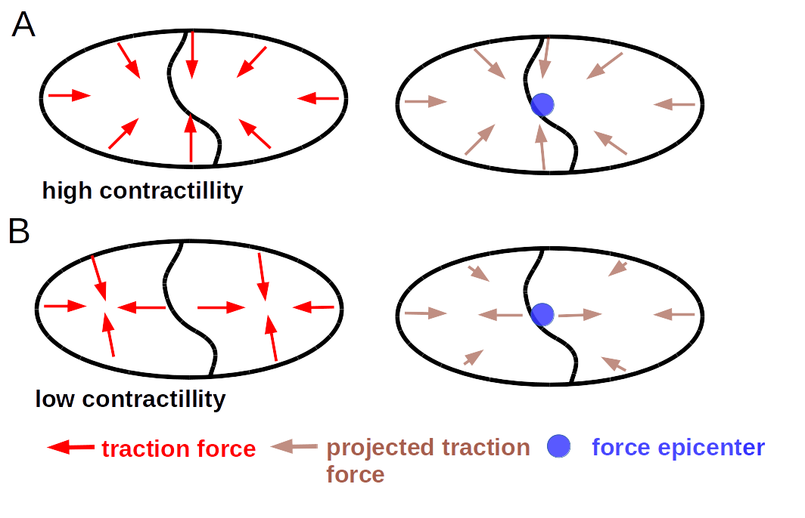
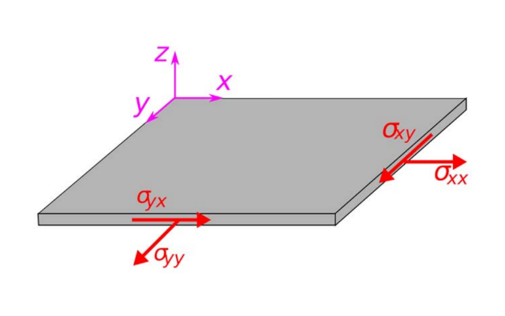

Typical Measures for Force Generation and Stresses in Cells
===============================================================
There is a number of different ways to measure force generation and stresses. Here you can find
an overview of all quantities that can be calculated with this program.

Deformations in the Substrate
-------------------------------
The simplest way is to sum up all deformations on the substrate surface that the cells are attached to.
The deformations depend on the mechanical properties of the substrate, which means that this is not
possible to compare results, when different substrates have been used.

Strain Energy
-----------------
The strain energy is the total work that cells have to commit to deform their substrate. It is
defined as :math:`\frac{1}{2} \int \vec{d} \times \vec{f}`, where :math:`\vec{d}` and :math:`\vec{f}`
are the deformation and the traction force vectors. That means that a high strain energy only needs a
local alignment of both vectors.

.. actually force vector...

Contractillity
---------------
The contractillity is defined as the sum of the projection of all traction forces towards one point,
called the force epicenter. As such, the contractillity is high if all force are already orientated towards
one central point. Locally opposing forces and forces not pointing towards the force epicenter do
not contribute to the contractillity. A cell or cell colony which is able to coordinate
its force generation in such a way that the forces seem to originate from a single point can achieve
a high contractillity, while expending a comparably small amount of strain energy.

This is further illustrated in :numref:`contractillity`. Case A represents a cell colony with two cells
with high coordination of force generation and Case B represents a cell with coordination. In case B
each cell generates contractile forces on its own. Accordingly case B has a lower contractillity if we
assume equal strain energy in Case A and B.

To sum up: the strain energy is a measure for the total force generation, while the contractillity is a
measure for the coordinated force generation.

Average Normal and Shear Stress
--------------------------------

.. mention maximum principal stress...
    TODO: implement maximum pricipal stress

Stress describes the forces that are transferred inside of a cell or cell sheet. For any given point
in the cell sheet the stress is defined by a tensor with 4 components. Each component represents forces
that would act on the edges of a square that was cut out of the cell sheet as shown in :numref:`stress_tensor`.

  :math:`\sigma_{xx}` and :math:`\sigma_{yy}`: Normal Stresses  in x and y direction.
  :math:`\sigma_{xy}` and :math:`\sigma_{yx}`: Shear stresses.

We can distinguish between two types of stress: The shear stress, which implies forces that act parallel
to the edges of this square, and normal stress, which implies forces that act perpendicular to the edges of this square.
Due to geometric reasons both shear components of the stress tensor must be identical. This
is not the case for the normal components. Since it is not of interesst whether normal stress
comes predominately from the x or y directions for our analysis, it is more useful to calculate the mean of
both components. This leaves two stresses: the shear stress and the mean normal stress. These stresses
can be averaged over the whole cell colony area.

.. note::
    The mean normal stress can be either negative, indicating a compressive stress, or positive,
    indicating a tensile stress. A typical cell experiences tensile stress, as it pulls
    on the underlying substrate from its edges .The shear stress can also have a positive or a
    negative sign. However, there is no useful interpretation in this case.

.. TODO: decide weather to report the mean stress or the mean mean abs. value of the stress

Distribution of Stresses
--------------------------------

The distribution of stresses can be described by the Coefficient of Variation (CV), that is
the standard deviation normalized with the mean, of mean normal or shear stress.

Forces acting across Cell Boundaries
--------------------------------------
As hinted above, the stress tensor can be used to calculate the force that acts across a boundary in the
cell colony. This force is called the line tension, and has a straight forward interpretation:
Imagine you were to actually cut the cell sheet along the boundary between two cells. If the cells
continue to generate force the edges of this cut would drift apart or start overlaping
as you have just cut the material holding both edges together. In order to hold both edges in place
as they were before you cut them, you need to apply a force at the edges. This force, normalized
by the length of the cut, is the line tension.

The line tension is a vector with x and y components. Similar to stresses it can be split in a
shear component (the force acting parallel to the cut) and a normal component (the force acting
perpendicular to the cut). Both contribute to the magnitude (length of the line tension vector)
of the line tension.

.. note::
    Similar to normal stresses, the normal component of the line tension can be negative or
    positive, indicating that the two sides of the edge along which the line tension
    was calculated, are pushed together or pulled apart. The shear component of the line
    tension lacks such an interpretation and the magnitude of the line tension
    can of course only be positive.

.. TODO: decide weather to return magnitude or not

..  Imagine the cell
    sheet to be as a sheet of paper
    If you where
    to cut a small
    figure:: line_tension.png
    width: 400
      :alt: Illustration for contractility

