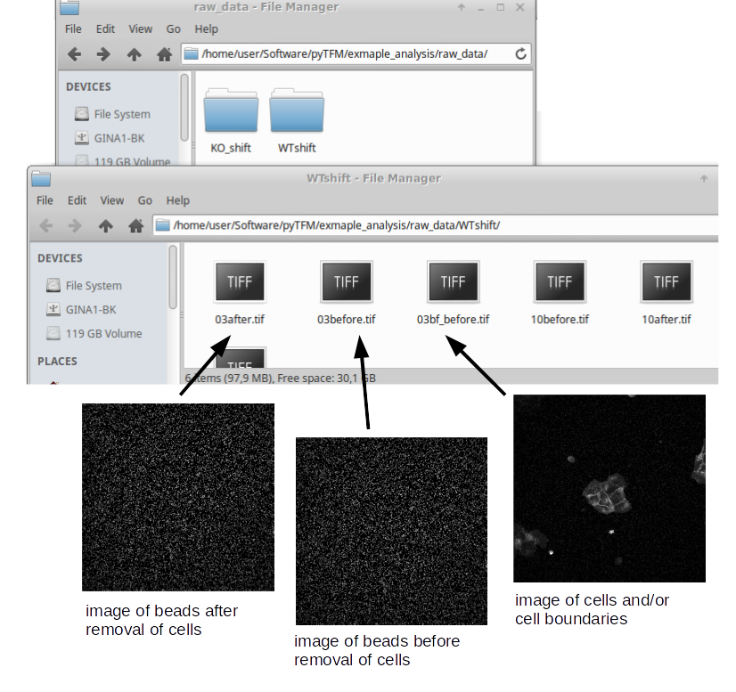
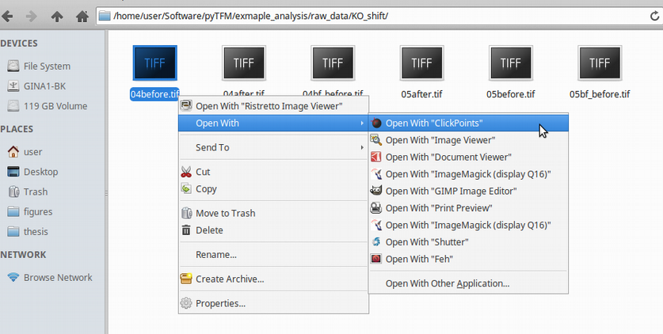

Tutorial
=================================

Analyzing Force Generation and Stresses in Cell-Colonies with Clickpoints
---------------------------------------------------------------------------

Prequisites
-------------
Using the clickpoints-addon in pyTFM obviously requires clickpoints. If you set up clickpoints correctly, you can
open images by right clicking on the image files and select "open with clickpoints".

The Data
-----------
The pyTFM package that you can find on github contains an example dataset in the /example_analysis folder.
It contains raw data for 2 types of cell colonies: In one group critical cytoskeletal protein has been knocked out.
We will compare these cell colonies to a set of wildtype colonies.
As you can see in Figure... there are 6 images in for each colony type. This corresponds to two field of views that
for each colonies. For each field of view you need 3 images. One image (03after.tif) shows the the colony and the
boundaries between cells. In this case the image shows fluorescently stained cell membranes.
The other two images show beads that are embedded in substrate that the cell lie on. One image was recorded before
the cells were removed (03before.tif) and the other was recorded after the cells were removed (03after.tif).
The number in front of the filename ("03","10" and so on) indicates which field of view that image belongs to.

Opening Clickpoints and sorting Images
------------------------------------------

The first step to analyze the data is to create a clickpoints database, in which the images are identfied correctly,
concerning their type (whether its an image of the cells or an image of the beads before or after the cell removal)
and the field of view (formul) they belong to.

To open a database simple right click on an image and select "open with clickpoints".

Clickpoints sorts images in two dimensions: Frames and layers. The frames are displayed in the bar at the bottom.
You can skip from frame to frame  using the left and right buttons on your key bord (formul). Layers can be changed
with the "Page Up" and "Page Down" buttons. When you opend the database, you will notice that there is only one layer
and every image is sorted into a new frame. Our goal is to sort each field of view into one frame, with three layers
each representing one type of image. In order to do this you need to open the pyTFM addon and open the "select image"
menue. Follow the steps described in Figure ...

