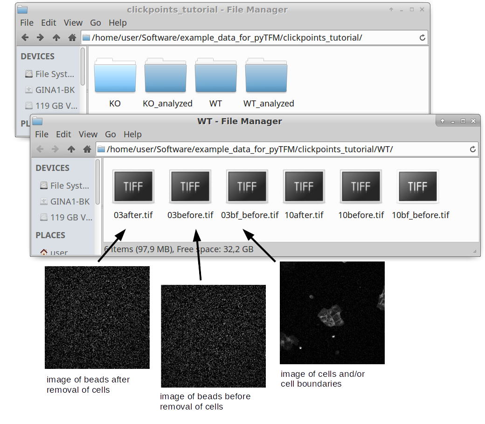
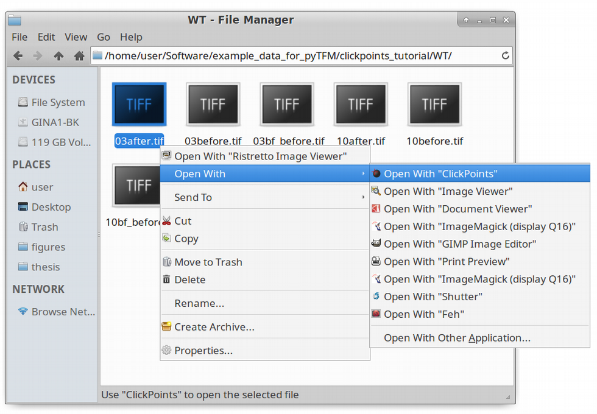
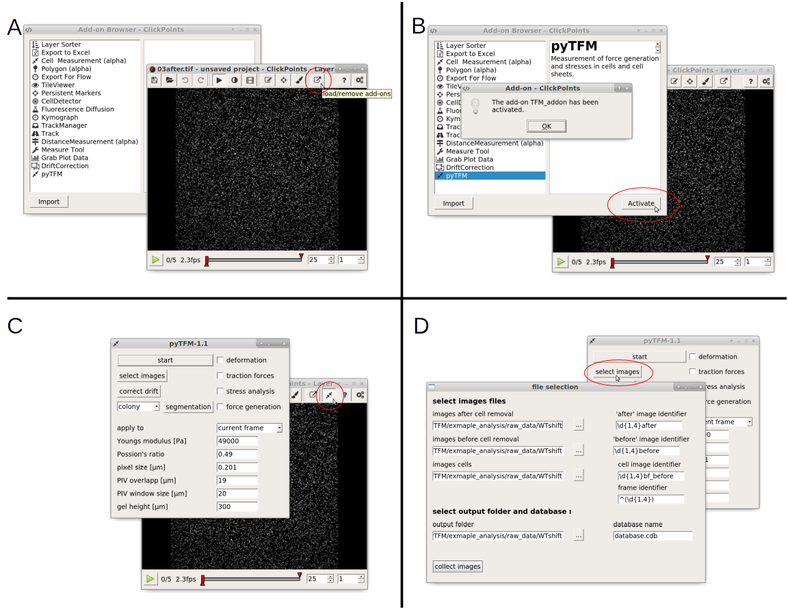
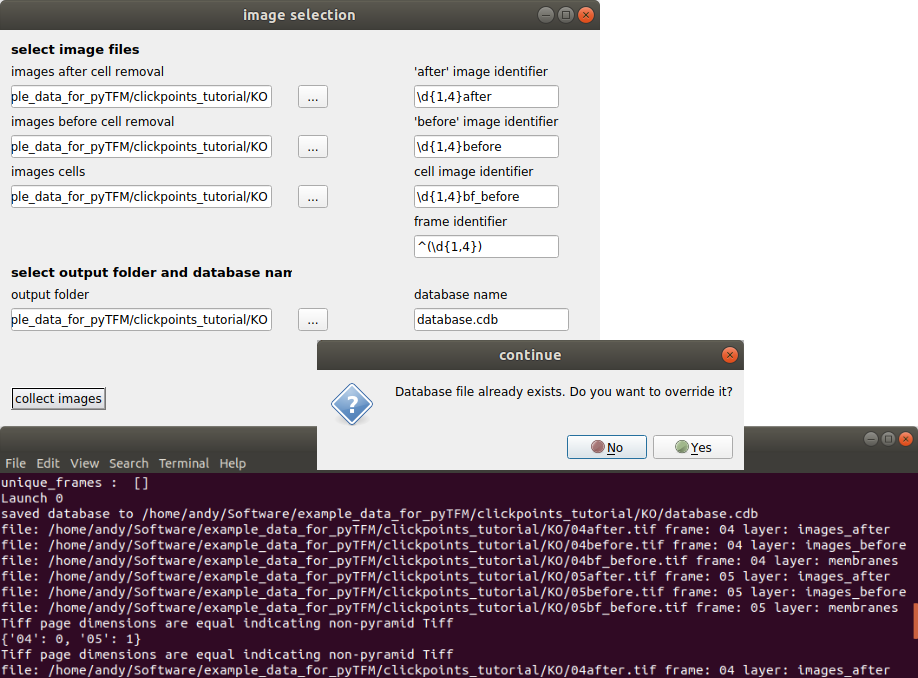
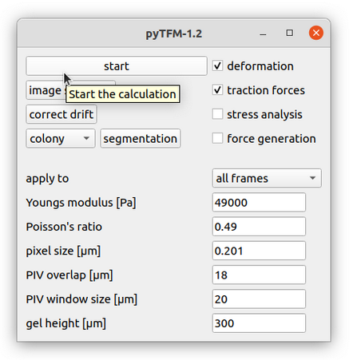
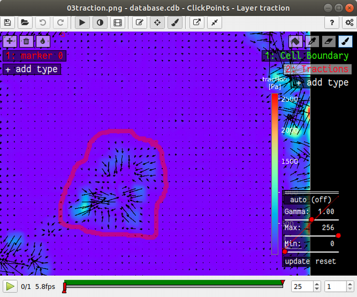
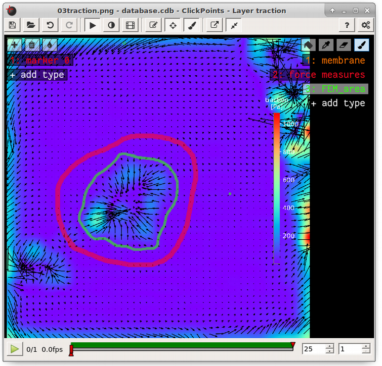
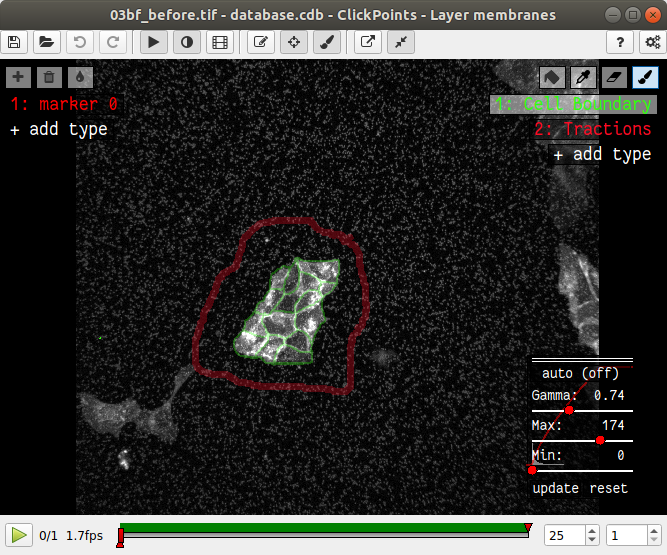
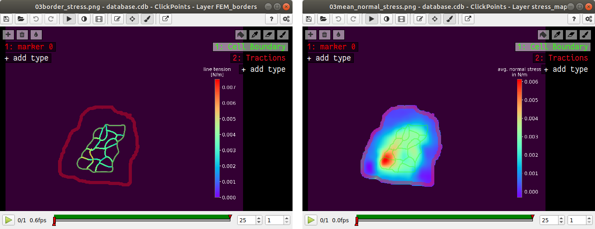
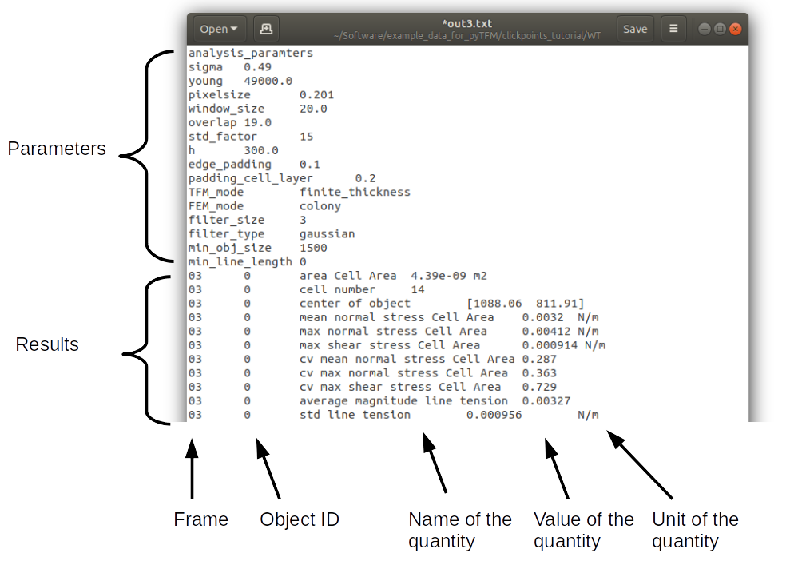

Tutorial
=================================

Analyzing Force Generation and Stresses in Cell-Colonies with Clickpoints
---------------------------------------------------------------------------

About this Tutorial
-------------------
Using the clickpoints-addon in pyTFM obviously requires clickpoints. If you set up clickpoints correctly, you can
open images by right clicking on the image files and select "open with clickpoints".

The pyTFM package contains an example dataset in the folder "/example_analysis" .
It contains raw data for 2 types of cell colonies: In one group a critical cytoskeletal protein has been knocked out.
We will compare these cell colonies to a set of wildtype colonies. The raw data, in the for of images,
is contained in the subfolder "WT" and "KO". All output files, databases and plots as you should produce them
in the course of this tutorial are stored in the folders "KO_analyzed", "WT_analyzed" and "plots". Use these folders
to check if your analysis is correct.

The Data
-----------

As you can see in Figure... there are 6 images in for each colony type. This corresponds to two field of views that
for each colonies. For each field of view you need 3 images. One image (03after.tif) shows the the colony and the
boundaries between cells. In this case the image shows fluorescently stained cell membranes.
The other two images show beads that are embedded +in substrate that the cell lie on. One image was recorded before
the cells were removed (03before.tif) and the other was recorded after the cells were removed (03after.tif).
The number in front of the filename ("03","10" and so on) indicates which field of view that image belongs to.

Opening Clickpoints and sorting Images
------------------------------------------

The first step to analyze the data is to create a clickpoints database, in which the images are identfied correctly,
concerning their type (whether its an image of the cells or an image of the beads before or after the cell removal)
and the field of view (formul) they belong to.
We are going to start with the wildtype dataset. To open a database simple right click on an image and
select "open with clickpoints".

Clickpoints sorts images in two dimensions: Frames and layers. The frames are displayed in the bar at the bottom.
You can skip from frame to frame  using the left and right buttons on your key bord (formul). Layers can be changed
with the "Page Up" and "Page Down" buttons. When you opend the database, you will notice that there is only one layer
and every image is sorted into a new frame. Our goal is to sort each field of view into one frame, with three layers
each representing one type of image. In order to do this you need to open the pyTFM addon and open the "select image"
menu. Follow the steps described in Figure ...

  A: Open the Addon-browser in clickpoints. A new window
  , with all available addons will open. B: Activate the pyTFM
  addon by selecting pyTFM and clicking the "Activate"
  buton. A notification that the addon has been loaded
  successfully will appear. After you press "OK" a new Icon
  will appear in the clickpoints main window, to the right of the
  Addon-browser button. C: Click on this button to open the
  pyTFM Addon. D: Finally, open the menu to select images
  by pressing the "select images" button.

The "file selection" manu allows you to do three things: First you can select where images are located  how they are classified. You can also set an outputfolder, where the database file and all analysis
results will be saved and you can choose a name for the output database.
As mentioned above, the analysis requires three types of images. For each type you can select a folder
(left hand side) and a regular expression that identifies the image type from the image filename.

.. note::
   Regular expressions are the standart way to find patterns in text. For example, it allows you to
   identifie numbers of certain length, groups of characters or the beginning and end of a text. You
   find more inforamtion on regular expresions `here <https://docs.python.org/3/library/re.html>`_.
   Some usefull expressions are listed in the table below:

   ==============    ==============================================================
   search pattern     meaning
   ==============    ==============================================================
   after              all files with "after" in the filename
   ^after             all files with "after" at the beginning of the filename
   after$             all files with "after" at the end of the filename
   \*                 all files
   ^(\d{1-4}) 	      up to 4 numbers at beginning of the filename
   (\d{1-4}) 	      up to 4 consecutive numbers anywhere in the filename
   (\d{1-4})$ 	      up to 4 numbers at end of the filename
   ==============    ==============================================================

The "'after' image identifier" identifies images of beads after cell removal, the "'before' image identifier"
identifies images of beads before cell removal and the "cell image identifier" identifies images that
show the cells or cell membranes. Finally, there is a sperate regular expression, the
"frame identifier" that identifies the field view each image belongs to. This must point to a
number (e.g."02" or "2" and so on) in the image filename. This number must be specially marked as a group
(formul..) by using brackets "()". Note that the extension (".png",".tiff", ".jpeg" ...) must not
be included in the identifiers. The default identifiers fit to the example data set, meaning that
if you are using this data set or the same naming scheme for your images, you don't need to change
anything.

Once you have entered identifiers for image types, frames, the output folder and the database name
press the "collect image" button. You should see something like this:

Make sure your database didn't contain any masks that you dont't want to delete. If you just opend the
databse from new images, you can press OK. The path to the images that are sorted into the databse,
the type of the images (layer) and the field of view of the images (frame) are printed to the console.
Make sure all images are sorted correctly. The program has now generated a clickpoints database and sorts
images into layers and frames. Your clickpoints window updates automatically.

.. TODO: mention correct Drift

.. TODO: paramters seting and recomondation

Setting Parameters
--------------------------------------------
Lets continue with calculating the deformation and traction field. Go to the pyTFM addon window
(Figure...).

In this window you have to set the mechanical parameters of the substrate ("Youngs modulus" and "Poisson's
ratio"), the height of the substrate ("gel height") and the pixel size ("pixel size"). Then you have to
parameters for the calculation of the deformation field.

The deformation field is calculated with
particle image velocimetry. This method essentially cuts out square shaped patches from image of
the beads before cell removal, places them on the image of beads after cell removal
and checks how well they fit together. This is done for many positions and the vector
form the original position of the patch and the
position where the patch fits best to the image of beads after cell removal is the displacement vector.
You can control two things: the size of the patch that is cut out of the image of the beads
after cell  removal (with the parameter "PIV window size") and the resolution of the
resulting displacement field (with the parameter "PIV overlap"). I recommand to choose the window size
to be roughly 7 times the beads diameter, you should however try a few values an check which
window size yields a smooth yet accurate deformation field.

.. Note::
   You can measure the beads diameter directly in the clickpoints, using another addon:
   The Measrue Tool

The "PIV overlap" mainly controlls the resolution of the resulting displacement field and must be
smaller then the "PIV window size" but at least half of the "PIV window size". You need
a high resoultion for analyzing stress. In this step the area of cells should at least contain 1000
pixels. However, if you are not calculating stresses, you can save a lot of calculation time by choosing a
"PIV overlap" closer to half of the "PIV window size".

For this tutorial you can keep all parameters at their default value.

Calculating Traction and Deformation Fields
--------------------------------------------
Once you have set all parameters you can start the calculation: Use the tick boxes in the upper right to select
which part of the analysis you want to perfor. For now we are gonna select "deformation" and "traction". Then
use the "apply to" option to choose whether all frames should be analyzed or only the frame that you are currently
viewing. Finally press "start" in the upper left to begin the analysis. With the default parameters this takes
about 5 minutes per frame. "calculation completed" is printed to the console, once all frames have been analyzed.

The traction and deformation fields are added to the database as new layers. Switch to these layers using the "page up"
key on your keyboard. Traction and deformation for the first frame in the wild type data should look like this:

.. figure:: images/def_trac_res.png
   :width: 750
   :alt: Main addon window

If you do not see the display tool and mask names ("membrane", "force measures", "FEM area" on the right press F2

Quantifying Force Generation
-------------------------------

Force generation is quantified with the strain energy and the contractillity. You have to select an area on
which these measures are to be calculated. You can do this by drawing a mask in clickpoints. In the top right
of the clickpoints window you can see a set of tools to draw mask and three preset types of masks. If you
don't see these tools, press F2.

.. hint:: **Tips for masks in clickpoints.**
   Select a mask and use the brush tool |brush| to draw it. You can
   in crease and decrease the size of the prush with the "+" and "-" keys. If you want to
   erase a part of a mask use the eraser tool |rubber|. Additionally you can fill holes in your mask with
   the bucket tool |bucket|. Mask types cannot overlap, which means that you erase one mask type when you
   paint over it with another type. Sometimes you will have a hard time seeing things have covered with
   the mask. Press "i" and "o" to decreaser and increase the transparency of the mask.

  .. |brush| image:: images/brush.png
  .. |rubber| image:: images/rubber.png
  .. |bucket| image:: images/bucket.png

The mask type used to calculate strain energy and contractility is called "foce measures". Select this mask and
draw a circle around all deformations and force that you think belong to the cell colony. The area you encircle
is typically large then the cell colony itself. You don't need to fill the area you have encircle. This is done
automatically. However, if you get the "no mask found in frame .." message, you should first make sure that there
is no gap in the circle that you drew. I drew the mask like this:

Its no big deal if your selection is a bit to big, but you should make sure not to include deformations and
force that do not originate from the cell colony.

You could now press start again, and the programm would generate a text file with contractillity and strain energy
for all frames. In order be a bit more organized and get all results one text file, we will first prepare
to analyze stresses in the cell sheet

Measuring Stresses
-------------------------------

The stress is calculated by modelling the cell colony as a 2 dimensional sheet and applying the traction
forces that we have just calculated to it. Due to inaccuracies in the traction force calcualtion, namely
that some tractions are predicted to originate from outside of the cell sheet, it has proven most accurate to
use an area slightly larger then the cell colony and includes all tractions that you think originate form the
cell colony. To select this area, go to the clickpoints main window and switch layers with the "page up" or
"page down" key untill you reach the plot displaying the trraction forces. Select the mask "FEM_area" and
encircle all tractions originating from the cell colony. I drew the mask like this:

Drawing the mask larger then the area where tractions forces are present will lead to an understimation
of stresses, the effect is however quite small for any reasonable mask sizes.

Measuring the Line Tension, counting Cells and measuring the Colony Area
---------------------------------------------------------------------------------------------

Finally, we want to measure forces that are trasmitted accros the cell-cell-boundaries. This requires you
to mark the cell membranes. Once you have markerd the membrane, you will also get the number of cells
in each colony and the area of the cell colony, which is usefull to normalize stresses and forces.

In the main window of clickpoints switch to the image showing the cell membrane, using the the "page up" or
"page down" key,elect the mask "membrane" and mark all cell membranes.

.. hint:: Press F2 and use the controlls in the bottom |control| right to a just the contrast of the image, to
   see the membrane staining better.

  .. |control| image:: images/control.png

Use a thin brush and make sure that there are no
unitentional gaps. Also mark the outer edge of the colony. This edges is not included in the calculation
of line tensions, but is necessary to calculate the correct area and cell count of the colony.
I drew the mask like this:

Once you have drawn all mask in all frames you are ready to start the calculation. Go to pyTFM addon window,
tick the checkboxes for "stress analysis" and "force generation", make sure you have set "apply to" to "all
frames" and press start. The calculation should take about 5 minutes.

After the calculation is complete two new plots will be added to the database. The first will show the
mean normal stress in the cell colony and the second will show the line tension along all cell cell borders.
The outer edge of the cell colony is marked in grey. These lines are not used in the calculation.

.. note::
   **A few notes on the calculation of stresses.**
   The average stresses (average mean normal and average shear stress) and the coefficient of variation of these
   stresses is calcualted by averageing over the true area of the cell colony, marked with the mask "membrane".
   The mean normal stress should be high in areas where strong force oppose each other, as can be seen in Figure
   ... . Likewise, the line tension is high if strong forces oppose each other accross the line. A high mean normal
   stress does not necessarly mean a high line tension. It is better to look at the traction forces, when checking
   if the results make sense.

Understanding the output File
---------------------------------
Every time you press start, the program creates a text file "out.text" in the output folder.
If such a file already exists, the new file is named out0.txt, out1.txt and so on. The out put starts with a
header containing important parameters of the calculation (Figure ....). This is followed by a section containig all
results. Each line has 4 to 6 tab-delimted columns, containing the frame, the id of the object in the frame (if you
analyze multiple cells or cell colonies), the name of the quantity, the value and optionally the unit of
the quantity and a warning.

Warnings such as "mask was cut close to image edge" and "small FEM grid" should not be ignored.

Plotting the Results
---------------------------------
Repeat the same Analysis for the KO data set. Once you have output text files for both datasets you could go
ahead and use any tool of your choosing to read the files and plot the important quantities. Of course the best
tool to do so is python, where pyTFM provides specialized functions to read and plot data.

First lets import all fucntions that we need:

.. code-block:: python

   from pyTFM.data_analysis import *

Next we read output files for wildtype and KO datasets. This is done in two steps: first the
Text files are read into a dictionary where they are sorted for the frames, object ids and the type
of the quantity. Then this dictionary is reduced to a dictionary were each key is the name of a
quantity and the value is an list of the measured values.

.. code-block:: python

  # reading the Wildtype data set. Use your own output text file here
  file_WT="/home/user/Software/pyTFM/example_analysis/WT_analyzed/out.txt"
  # reading the paramters and the results, sorted for frames and object ids
  parameter_dict_WT,res_dict_WT=read_output_file(file_WT)
  # pooling all frames together.
  n_frames_WT,values_dict_WT, frame_list_WT=prepare_values(res_dict_WT)
  # reading the KO data set. Use your own output text file here
  file_KO="/home/user/Software/pyTFM/example_analysis/KO_analyzed/out.txt"
  parameter_dict_KO,res_dict_KO=read_output_file(file_KO)
  n_frames_KO,values_dict_KO, frame_list_KO=prepare_values(res_dict_KO)

We are going to use the dictionaries with pooled values (values_dict_WT and values_dict_KO) for plotting.
First let's do some normalization: We can guess that a larger colony generates more forces. If we assume
the relation is somewhat linear it is usefull to normalize measures for the force generation with
the area of the colony:

.. code-block:: python

    # normalizing the strain energy
    values_dict_WT["strain energy per area"]=values_dict_WT["strain energy on colony"]/values_dict_WT["area of colony"]
    values_dict_KO["strain energy per area"]=values_dict_KO["strain energy on colony"]/values_dict_WT["area of colony"]
    # normalizing the contractility
    values_dict_WT["contractillity per area"]=values_dict_WT["contractillity on colony"]/values_dict_WT["area of colony"]
    values_dict_KO["contractillity per area"]=values_dict_KO["contractillity on colony"]/values_dict_WT["area of colony"]

Note that this only works if force generation and area were calculated successfully for all colonies.

Now we can perform a t-test to check if there are any significant diffrences between KO and WT. We will do
this for all value pairs now and later display the most important ones.
Unfortunately, due to the the fact that we analyzed only two colonies
per dataset you will find no significant diffrence in this case.

.. code-block:: python

    # t-test for all value pairs
    t_test_dict=t_test(values_dict_WT,values_dict_KO)

Let's produce some plots. First we are gonna compare key measures with boxplots. The function
"box_plots" expects two dictionaries with values, a list ("labels") with two elements, wich identifies
these dictionary and a list (types) of measures that you want to plot ("types"). Additionally you can provide
a dictionary containig statistical test results and specify your own labels and axis limits:

.. code-block:: python

  lables = ["WT", "KO"] # designations for the two dictionaries that are provided to the box_plots functions
  types = ["contractillity per area", "strain energy per area"] # name of the measures that are plotted
  ylabels = ["contractillity per colony area [N/m²]", "strain energy per colony area [J/m²]"] # custom axes labels
  # producing a two box plots comparing the strain energy and the contractillity in WT and KO
  fig_force = box_plots(values_dict_WT, values_dict_KO, lables, t_test_dict=t_test_dict, types=types,
             low_ylim=0, ylabels=ylabels, plot_legend=True)

We can do the same for the mean normal stress and line tension:

.. code-block:: python

  lables=["WT", "KO"]  # designations for the two dictionaries that are provided to the box_plots functions
  types=["contractillity per area", "strain energy per area"] # name of the measures that are plotted
  ylabels=["contractillity per colony area [N/m²]", "strain energy per colony area [J/m²]"] #
  fig_stress = box_plots(values_dict_WT, values_dict_KO, lables, t_test_dict=t_test_dict, types=types,
             low_ylim=0, ylabels=ylabels, plot_legend=True)

Another interesting way of studying force generation is to look at the relation between strain energy (beeing
a measure for total force generation) and contractillity (beeing a measure for the coordinated force generation)
This can be done as follows:

.. code-block:: python

  lables=["WT", "KO"]  # designations for the two dictionaries that are provided to the box_plots functions
  # name of the measures that are plotted. Must be length 2 for this case.
  types=["contractillity per area", "strain energy per area"]
  # plotting value of types[0] vs value of types[1]
  fig_force2 = compare_two_values(values_dict_WT, values_dict_KO, types, lables,
            xlabel="contractillity per colony area [N/m²]",ylabel="strain energy per colony area [J/m²]")

Finally, let's save the figures.

.. code-block:: python

  # define and output folder for your figures
  folder_plots = "/home/user/Software/pyTFM/example_analysis/plots/"
  # create the folder, if it doesn't already exist
  createFolder(folder_plots)
  # saving the three figures that were created beforehand
  fig_force.savefig(os.path.join(folder_plots,"forces1.png")) # boxplot comparing measures for force generation
  fig_stress.savefig(os.path.join(folder_plots,"fig_stress.png")) # boxplot comapring normal stress and line tension
  fig_force2.savefig(os.path.join(folder_plots,"forces2.png")) # plot of strain energy vs contractillity

.. TODO: make detailed list of functions, warnings, and result values

